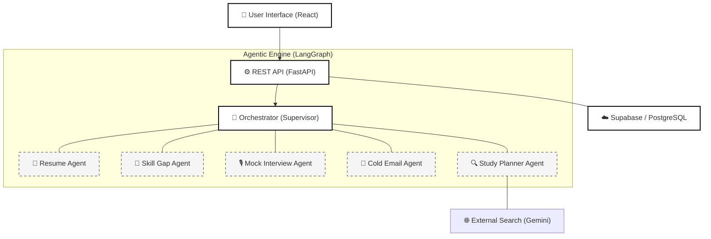

# 🚀 CareerLM
### Multi-Agent LLM Intelligence for Career Readiness

CareerLM is an AI-driven career optimization platform that helps job seekers improve their resumes, close skill gaps, and prepare for interviews. It uses an agentic architecture (LangGraph) to coordinate specialized agents and deliver personalized guidance across the full job-search journey.

---

## 🏗️ Architecture: 5 Agents + 1 Orchestrator

The core of CareerLM is its modular, agentic structure. A centralized orchestrator (Supervisor) manages the state and directs tasks to five specialized agents, ensuring a cohesive and personalized user experience.

### 1. 🧠 The Orchestrator (Supervisor)
The brain of the system. It evaluates the user's current career track (Exploring, Building, Applying, or Interviewing) and dynamically recommends the most high-impact next step. It maintains the global state and ensures smooth handoffs between specialist nodes.

### 2. 📄 Resume Agent
Focuses on document integrity and optimization. It provides ATS scoring, structural feedback, and identifies missing information based on recruiter-standard benchmarks.

### 3. 🎯 Skill Gap Agent
Analyzes the user's current expertise against target role requirements. It identifies specific technical and soft skill deficits and categorizes them by priority and time-to-mastery.

### 4. 🎙️ Mock Interview Agent
Simulates realistic interview scenarios tailored to the user's experience and the target position. It provides feedback on response structure (STAR method) and technical accuracy.

### 5. 📧 Cold Email Agent
Generates personalized outreach communications. It uses the user's profile and target job descriptions to draft emails designed to maximize response rates from recruiters and hiring managers.

### 6. 🔍 Study Planner Agent
Translates identified skill gaps into a structured learning roadmap. It integrates with external search data (via Gemini Search Grounding) to recommend current, high-quality learning resources.

---

## ⚙️ System Workflow



---

## 🛠️ Technical Stack

| Component | Technologies |
| :--- | :--- |
| **Backend Framework** | Python 3.10+, FastAPI |
| **Agent Orchestration** | LangGraph |
| **Frontend Framework** | React 18, Tailwind CSS |
| **Inference Engines** | Groq (Llama-3.1-8B), Gemini 2.0 Flash |
| **Data & Authentication** | Supabase, PostgreSQL |

---

## ✨ Core Capabilities
- Resume analysis, ATS scoring, and structure feedback
- Skill gap analysis aligned with target roles
- Mock interview practice with structured feedback
- Cold outreach email drafting
- Study plan generation with resource grounding
- Profile and resume management with secure auth

---

## 📁 Project Structure
```
backend-fastapi/    # FastAPI API, agent orchestration, and services
frontend-react/     # React UI
docs/               # Product and setup documentation
scripts/            # Data ingestion and graph utilities
tests/              # Backend tests
```

---

## 🚦 Setup and Installation

### Prerequisites
- Python 3.10 or higher
- Node.js 18 or higher
- Access keys for Groq, Gemini, and Supabase

### 1️⃣ Backend Setup
1. Navigate to the backend directory: `cd backend-fastapi`
2. Install the required Python packages: `pip install -r requirements.txt`
3. Configure the `.env` file with your API credentials:
   ```env
   GROQ_API_KEY=your_key_here
   GEMINI_API_KEY=your_key_here
   SUPABASE_URL=your_url_here
   SUPABASE_KEY=your_key_here
   ```
4. Run the API server: `uvicorn app.main:app --reload`

### 2️⃣ Frontend Setup
1. Navigate to the frontend directory: `cd frontend-react`
2. Install the node modules: `npm install`
3. Start the application: `npm start`

---

## 🔐 Environment Variables
Backend environment variables are loaded from `backend-fastapi/.env`.

Minimum required:
```env
GROQ_API_KEY=your_key_here
GEMINI_API_KEY=your_key_here
SUPABASE_URL=your_url_here
SUPABASE_KEY=your_key_here
```
---

## 📚 Documentation
See the `docs/` directory for feature guides and setup notes.

---

## 🔒 Data Governance
CareerLM utilizes Supabase Auth for secure session management. Resume data is processed in real-time to provide feedback and is stored securely in a PostgreSQL instance.
